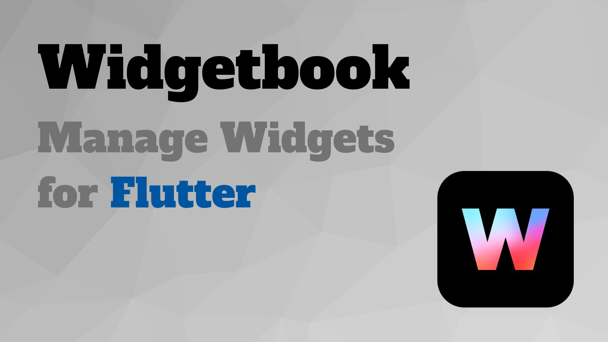
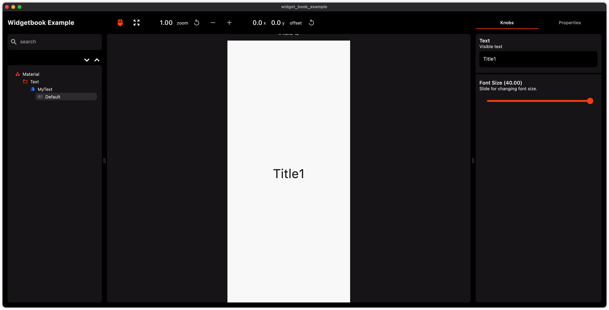

# widgetbook-example

  
  &nbsp
  
  &nbsp
  

Widgetbook can manage useful widgets for projects and be the showcase place.

## Article
[學會運用 Flutter Widgetbook，該管好自己和公司的元件庫了！](https://medium.com/flutter-formosa/學會運用-flutter-widgetbook-該管好自己和公司的元件庫了-9b4ed704c4c5)

## Demo

## Weakness
I don't like to use `widgetbook_annotation` and `widgetbook_generation` for codegen. Because it cannot set knobs for dynamic data of functional widget. And it doesn't save much time for development.

## Contribute
- You can star and share with other developers if you feel good and learn something from this repository.
- If you have some ideas, please discuss them with me or commit PR.

## More of me

## Donate and encourage me
[![BuyMeACoffee][buy_me_a_coffee_badge]][buy_me_a_coffee]

<!-- Links -->
[buy_me_a_coffee]: https://www.buymeacoffee.com/yiichenhi
[buy_me_a_coffee_badge]: https://img.buymeacoffee.com/button-api/?text=Sponsor&emoji=&slug=yiichenhi&button_colour=FFDD00&font_colour=000000&font_family=Cookie&outline_colour=000000&coffee_colour=ffffff&size=64
